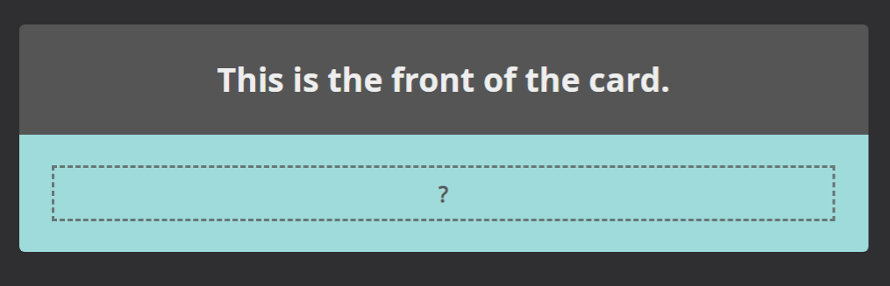
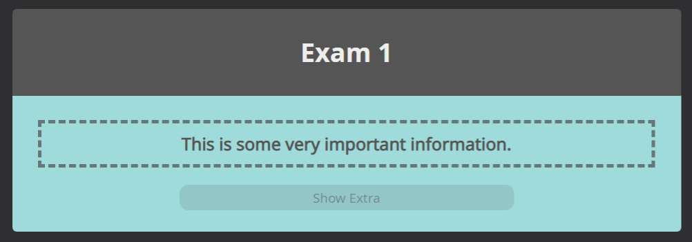
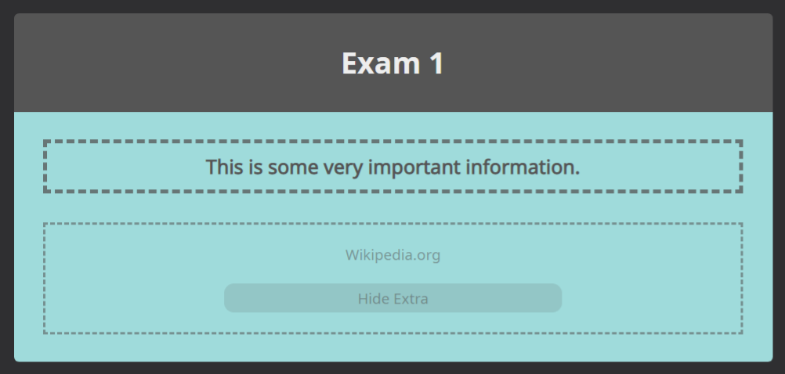
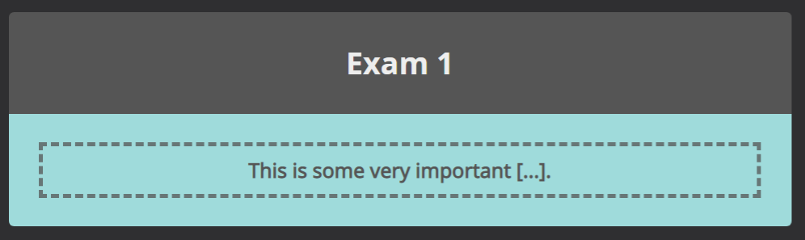
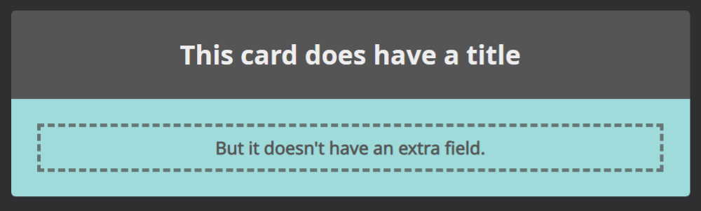
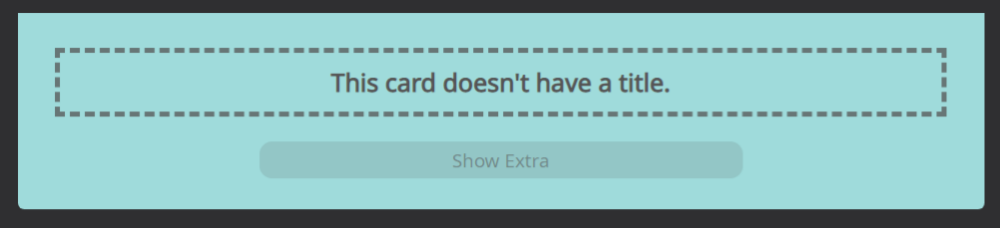

# How to import

Download this repository, open anki and click on "File" -> "CrowdAnki: Import from disk".
Select the correct directory and click import.

Note types (Not all of them are in this repo):
* Basic-Pretty - A pretty basic card with front and back
* Basic-Pretty-Animated - A pretty basic card with front and back, animated using css
* Cloze-Pretty - Pretty cloze card, also has a title and an extra field
* Media-Saver - Used to save media, such as backgrounds and flags, don't delete it unless you use the media in another card
* Merriam-Webster-Word - Cards generated programmatically, don't pay any attention to this at the moment
* Modern-Vocabulary - Experimental card for vocab
* Pretty-Word - Best card for vocab
* Vocabulary - Card for vocab

Fields of Ultimate Vocabulary Card:
* Id - Asign each note a unique id, if you don't know what you could use this for, you probably don't need to worry about it
* Word - This is at the top of the card, the word in your native language
* Word-Symbol - In case the target language has symbols
* Word-Symbol-2 In case there are multiple options for symbols (For example traditional and simplified)
* Back - This is the main field for the word in your target language
* Level - For example for HSK1 for chinese or N1 for japanese
* Mnemonic - A mnemonic, I highly recommend using one, especially for languages that are not similar to your native language
* Audio - Audio file for pronounciation of the word in your target language
* Sentence - A sentence incorperating the word
* Sentence-Meaning - A translation of the sentence
* lang - Field for the language, in iso code, currently supporting flags for china, germany, uk and spain 

This is largely based on the work of [u/TrainOfPotatoes](https://www.reddit.com/user/TrainOfPotatoes/), see his [original comment](https://www.reddit.com/r/Anki/comments/4n6cbf/does_anyone_have_a_goodlooking_anki_css_template/d41xugx/) and his [updated post](https://www.reddit.com/r/Anki/comments/ffs0ir/theme_an_update_to_my_previous_anki_template/).
