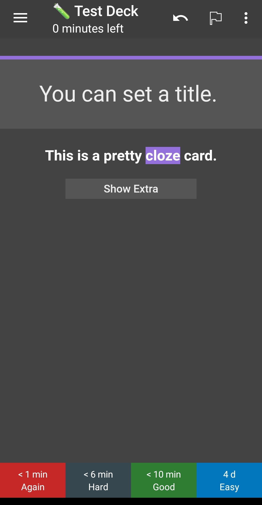

# Modern card themes for Anki.

A collection of anki note-types, with a matching modern design.

## Getting Started

### Prerequisites

* The crowd-anki addon

### Installation

1. Clone the repo
```sh
git clone https://github.com/b3nj5m1n/moderncardthemes.git
```
2. Open anki and click on "File" -> "CrowdAnki: Import from disk"
3. Select the correct directory (test_tube_Test_Deck)
4. Click import

### Configuration

* You should turn of autoplaying audio.

* Some cards require you to turn off some gestures on AnkiDroid. Mainly, you need some space to click on the screen without revealing the answer. You can do this by unassigning touch-bottom for example in the gesture settings.

* You can specify the color of the stripe at the top by using the tag `Color::` with a color in hex format, for example to indicate the gender of a word. For example: `Color::#07BBFC`.


## Usage

### Note Types

I've made some major changes to the available note types in this deck. (I removed most of the old ones, since I found I never actually used them)

* pretttyBasic - A pretty basic card with front and back
* prettyCloze - Pretty cloze card, also has a title and an extra field
* prettyPoem - A card for memorizing poems or quotes
* prettyWord - A card for memorizing vocabulary
* prettySentence - A card for memorizing sentences in a foreign language
* prettyPerson - A card for memorizing people
* prettyList - A card for memorizing lists
* prettyEvent - A card for memorizing an event
* prettyConjugation - A card for memorizing the conjugated forms of a word
* prettyBook - A card for memorizing information about a book

### prettyWord

This card has a lot of fields, so here is a brief explanation of which ones you need to worry about:
* ID - Use this to give each card a unique identity, this is mainly for the purpose of automating the addition of new cards to the deck and the updating of existing ones via external scripts.
* Word - The word you want to memorize.
* AudioWord - Audio of the pronounciation of the word you're trying to learn.
* WordTranslation - Translation of the word you're trying to learn in your native language.
* AudioWordTranslation - Audio of the word in your native language.
* Sentence - The word you're trying to learn used in an example sentence.
* AudioSentence - An audio of the example sentence.
* SentenceTranslation - A translation of the example sentence in your native language.
* AudioSentenceTranslation - An audio of the translation of the example sentence in your native language.
* Note/Mnemonic - A note about the word, or a mnemonic to make remembering the word easier.
* Picture - A picture representative of the word.
* CountryISO - ISO 3166-1 alpha-2 code of the country the language of the word you want to learn is used in; For example: de (Germany), es (Spain); (This will be used to show the flag of that card on the card)
* Level - For example HSK1
* Word-Symbol - For example the simplified chinese character
* Word-Symbol-2 - For example the traditional chinese character
* Language - An extra field in case you want to specify the language seperately from the country
* CreateReverse - Put something in this field if you want to have a reverse card created (Your target language -> your native language)

By default, upon seeing the front of the card, the audio of the word you're trying to memorize is played in the language the word is in, upon seeing the back of the card you'll hear the audio of the word in your native language.
Click on any of the elements that have audio (Word, WordTranslation, Sentence, SentenceTranslation) to play the audio for that.

### prettyPoem

You can use this note type to memorize poems, quotes or lyrics. When you see the front of the card, tap on it to reveal the first word of the text. (Try to remember what it was beforehand) Continue to work your way through the text like this. At the end, judge how well you were able to remember it.

### prettyList

You can use this note type to memorize lists. When you see the front of the card, tap on it to reveal the first element of the text. (Try to remember what it was beforehand) Continue to work your way through the text like this. At the end, judge how well you were able to remember it.
You need to put one (only one) ul or ol tag in the list field for the javascript to function correctly.

### prettyConjugation

For conjugations, you can specify the pronouns in a ; separated list, here are some examples:

* Spanish: `yo; tú; él/ella/ello, usted; nosotros/nosotras; vosotros/vosotras; ellos/ellas, ustedes;`
* French: `je; tu; il, elle, on; nous; vous; ils, elles;`
* Italian: `io; tu; lui, lei; noi; voi; loro;`
* Portuguese: `eu; tu; ele, ela, você; nós; vós; eles, elas, vocês;`
* Catalan: `jo; tu; ell, ella, vostè; nosaltres; vosaltres; ells, elles, vostès;`





